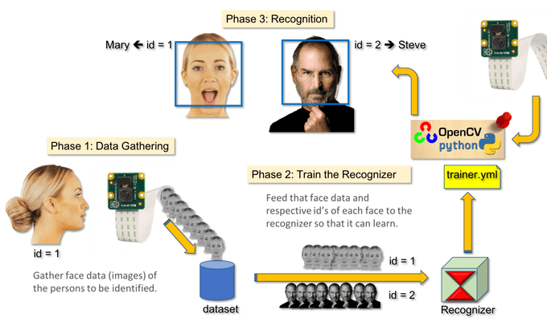

# PROYECTO-VISIONARTIFICIAL
Proyecto realizado en el módulo de  Visión Artificial y Procesamiento de Imagenes

- INSTITUTO SUPERIOR POLITÉCNICO CÓRDOBA - 

- TECNICATURA SUPERIOR EN CIENCIAS DE DATOS E INTELIGENCIA ARTIFICIAL-

PROFESOR: NARCISO PEREZ

INTEGRANTES: CHAYLE, CHRISTIAN - MEDINA, JORGE

PROYECTO VISIÓN ARTIFICIAL - "SISTEMA DE ACCESO 'LOGIN' CON RECONOCIMIENTO FACIAL

PRESENTACIÓN

Los modelos de deep learning se han convertido en los modelos de referencia dentro de muchos ámbitos, uno de ellos, la visión artificial o visión por computación. Un ejemplo de aplicación cada vez más extendido es el del reconocimiento facial, es decir, la identificación automatizada de las personas presentes en una imagen o vídeo.

De forma similar a como hacemos los humanos, para que un sistema informático sea capaz de identificar a las personas que aparecen en una imagen, son necesarias varias etapas:

Detectar las caras en la imagen.

-- Utilizar una red neuronal capaz de mapear las características de una cara humana en una representación numérica. Este paso se conoce como embedding o encoding.

-- Medir la similitud entre la representación numérica de las caras detectadas y las representaciones de referencia disponibles en una base de datos.

-- Determinar si son suficientemente similares para considerar que pertenecen a la misma persona y asignarle la identidad.

Objetivos:

-- El Proyecto tiene como objetivo principal realizar un sistema en Python donde se realiza un proceso 
de registro e inicio de sesión con detección y reconocimiento facial. Que el sistema detecte por ejemplo las entradas y salidas del personal utilizando 
el reconocimiento facial, teniendo un registro con la hoara de entrada, además de permitir al usuario gestionar los conjuntos datos que entrenarán el modelo a implementar.

-- Diseñar, implementar y verificar los algoritmos de procesado de imagenes que permita realizar la aplicación elegida para nuestro proyecto. 

Los sistemas de vision y procesado de imagenes basados en PC representan una alternativa a los sistemas convencionales.
utilizando una camara, una lente y un PC con el software y hardware adecuado, se puede desarrollar un sistema de visión artificial.
Hoy las aplicaciones de visión artificial y procesado de imagenes basadas en PC  son una realidad. Los avances tecnológicos y la evolución del PC nos permiten a los usuarios finales poder desarrollar
aplicaciones de procesado de imagen que antes estaban en manos de especialistas o de empresas con mayor poder adquisitivo.
Los sistemas de procesado de imagen son parte del modelado de instrumentación virtual en el cual el PC es la plataforma sobre la cual se desarrollan, entre otras cosas, 
las apliaciones de captura, procesado y/o almacenamiento de imágenes y de control de procesos basados en información gráfica y visual.

Alcance de Nuestro Proyecto:
    
El alcance de nuestro proyecto será que la aplicación deba poder reconocer a las personas de un grupo, además de poder gestionar ese grupo ya sea agregando,modoficando o 
eliminando las imagenes utilizadas por el algoritmo.
Este proyecto se realizó con la biblioteca de visión artificial de código abierto OpenCV. 
OpenCV fue diseñado para la eficincia computacional y con un fuerte enfoque en aplicaciones en tiempo real. Por lo tanto, es perfecto para 
el reconocimiento facial en tiempo real con una cámara.

